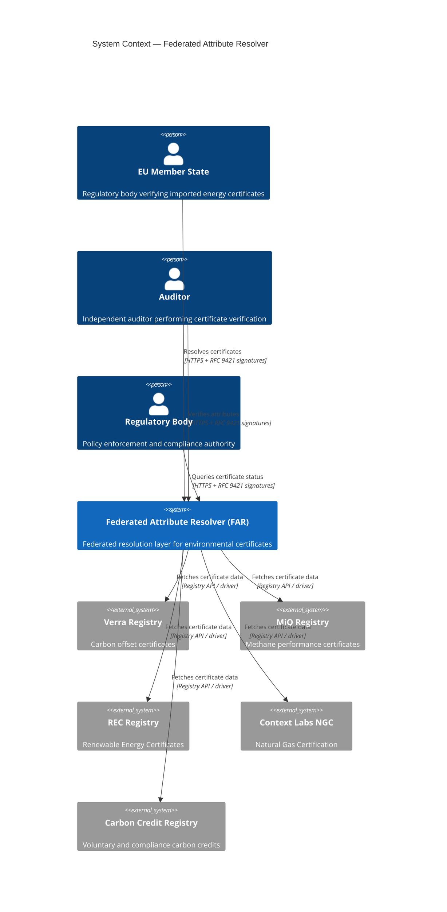
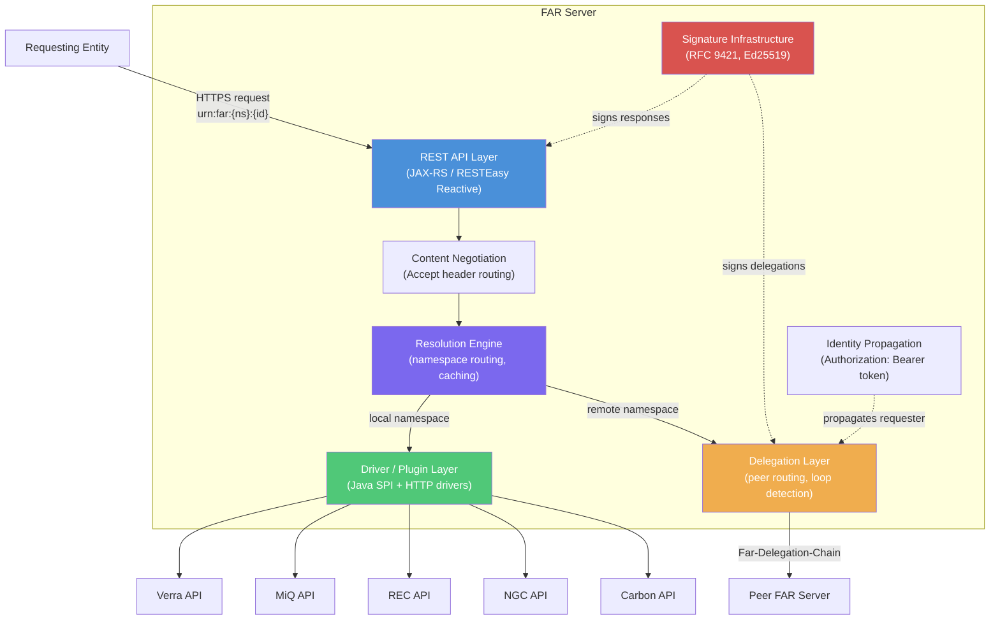

# Federated Attribute Resolver — Architecture Overview

## Problem Statement

Environmental certificate registries today exist as isolated, fragmented systems. Organisations such as Verra (carbon
offsets), MiQ (methane performance), Renewable Energy Certificate (REC) registries, Context Labs NGC (Natural Gas
Certification), and various carbon credit schemes each maintain their own databases, identifier formats, and
verification APIs.

This fragmentation creates several critical problems:

1. **No unified resolution mechanism.** A regulatory body seeking to verify an environmental attribute — for example,
   that a shipment of LNG carries a valid MiQ grade — must know which registry to query, how to authenticate, and how to
   interpret the response. There is no equivalent of DNS for environmental certificates.

2. **Double-counting risk.** When the same underlying environmental attribute is referenced across multiple registries
   or trading platforms, there is no federated mechanism to detect or prevent double-counting. Each registry operates in
   isolation.

3. **EU regulatory pressure.** The EU Methane Regulation (EU-MR) and related legislation increasingly require
   verification of environmental attributes associated with imported energy products. EU member states, auditors, and
   regulatory bodies need a reliable, standards-based mechanism to resolve and verify certificates issued by non-EU
   registries.

4. **Integration cost.** Every new consumer of certificate data must build bespoke integrations with each registry.
   Every new registry must negotiate bilateral connections with every consumer. The complexity grows quadratically.

The Federated Attribute Resolver (FAR) addresses these problems by providing a standards-based, federated resolution
layer that sits between certificate consumers and certificate registries — analogous to how DNS resolvers sit between
applications and authoritative name servers.

---

## System Context

The following diagram shows FAR within its operating environment. FAR servers form a federated mesh. Each server is
authoritative for one or more namespaces and can delegate resolution requests to peers for namespaces it does not own.

### Interaction Flow

1. A requesting entity (EU member state, auditor, regulatory body) sends a resolution request to any FAR server,
   identifying the certificate by its URN.
2. The FAR server inspects the namespace component of the URN and either resolves it locally (if it owns that namespace)
   or delegates to a peer.
3. Resolution involves invoking the appropriate registry driver, which translates the request into the registry's native
   API.
4. The response is signed, formatted according to the caller's Accept header, and returned through the delegation chain.

---

## Component Architecture

### Component Responsibilities

| Component                    | Responsibility                                                                                                                                                                                                                                                                                                 |
|------------------------------|----------------------------------------------------------------------------------------------------------------------------------------------------------------------------------------------------------------------------------------------------------------------------------------------------------------|
| **REST API Layer**           | Accepts incoming resolution requests, validates URN format, enforces authentication via RFC 9421 signatures.                                                                                                                                                                                                   |
| **Content Negotiation**      | Routes responses through the appropriate serializer (JSON, XML, CSV) based on the caller's Accept header.                                                                                                                                                                                                      |
| **Resolution Engine**        | Core routing logic. Determines whether a URN maps to a local namespace (invoke driver) or remote namespace (delegate to peer). Manages caching and request lifecycle.                                                                                                                                          |
| **Driver / Plugin Layer**    | Registry-specific adapters loaded via Java SPI (ServiceLoader). Each driver translates FAR's internal resolution model into the native API of a specific registry. Drivers can also fetch pre-formatted renditions (HTML, PDF, PNG) from the upstream source. HTTP-based drivers allow out-of-process plugins. |
| **Delegation Layer**         | Forwards resolution requests to peer FAR servers for namespaces not owned locally. Maintains the `Far-Delegation-Chain` header for loop detection. Enforces configurable depth limits.                                                                                                                         |
| **Signature Infrastructure** | Ed25519 key management, RFC 9421 HTTP message signing for both outbound requests and responses. Supports key rotation.                                                                                                                                                                                         |
| **Identity Propagation**     | Forwards the `Authorization: Bearer <JWS>` token unchanged through the delegation chain so that downstream registries and peer servers can make authorization decisions based on the original requester's identity claims.                                                                                     |

---

## Key Design Principles

### Namespace-Based Routing

Every certificate in FAR is identified by a URN of the form `urn:far:{namespace}:{identifier}`. The namespace component
determines which FAR server (or registry driver) is authoritative. This is directly analogous to DNS domain delegation —
the namespace is the routing key.

### Delegation Over Replication

FAR servers never replicate certificate data from registries they do not own. Instead, they delegate resolution requests
to the authoritative server. This ensures data freshness, avoids synchronisation complexity, and respects the
sovereignty of each registry.

### Identity Propagation

When a resolution request traverses multiple FAR servers, the identity of the original requester is preserved via the
`Authorization: Bearer <JWS>` token, which is forwarded unchanged through the delegation chain. The JWS token contains
identity claims (`sub`, `iss`, `iat`, `exp`) that allow leaf-node registries to make authorization decisions based on
who is actually asking, not which intermediate server is proxying.

### Content-Type Agnosticism

The resolution engine and driver layer operate on an internal attribute model that is format-independent. Serialization
to JSON, XML, CSV, or other formats happens at the API boundary via standard HTTP content negotiation. Adding a new
output format requires only a new serializer — no changes to the core.

### Pre-Formatted Renditions

In addition to structured attribute data, FAR can serve pre-formatted renditions — HTML pages, PDF documents, or PNG
images — fetched directly from the upstream registry. When a client sends `Accept: text/html`,
`Accept: application/pdf`,
or `Accept: image/png`, the driver retrieves the formatted content from its source and FAR passes the bytes through
unmodified. This preserves the authoritative formatting of the upstream registry without requiring FAR to maintain
rendering logic. Rendition support is optional per driver and per media type. See
[ADR-008](adr/ADR-008-renditions.md).

---

## Glossary

| Term            | Definition                                                                                                                                                          |
|-----------------|---------------------------------------------------------------------------------------------------------------------------------------------------------------------|
| **URN**         | Uniform Resource Name. A persistent, location-independent identifier for a resource. FAR uses the format `urn:far:{namespace}:{identifier}` per RFC 8141.           |
| **Namespace**   | The segment of a URN that identifies which registry or authority is responsible for a given certificate. Used as the routing key for resolution and delegation.     |
| **Resolver**    | A FAR server instance that accepts resolution requests and returns certificate attributes. A resolver may be authoritative for some namespaces and delegate others. |
| **Driver**      | A plugin that translates FAR's internal resolution protocol into the native API of a specific certificate registry. Loaded via Java SPI or invoked over HTTP.       |
| **Delegation**  | The act of forwarding a resolution request from one FAR server to another because the first server is not authoritative for the requested namespace.                |
| **Mesh**        | The topology formed by interconnected FAR servers, each authoritative for different namespaces and capable of delegating to peers. No central coordinator exists.   |
| **Peer**        | Another FAR server in the mesh to which resolution requests can be delegated. Peers are discovered via configuration or a registry of known servers.                |
| **Registry**    | An external system that is the authoritative source for a class of environmental certificates (e.g., Verra, MiQ, REC issuers).                                      |
| **Certificate** | A verifiable record asserting an environmental attribute — such as a carbon offset, methane intensity grade, or renewable energy credit.                            |
| **Attribute**   | A discrete, named property of a certificate (e.g., vintage year, grade, volume, status). Attributes are the atomic unit of resolution.                              |
| **Rendition**   | A pre-formatted view of certificate data (HTML, PDF, PNG) fetched from the upstream registry and passed through by FAR without modification.                        |
