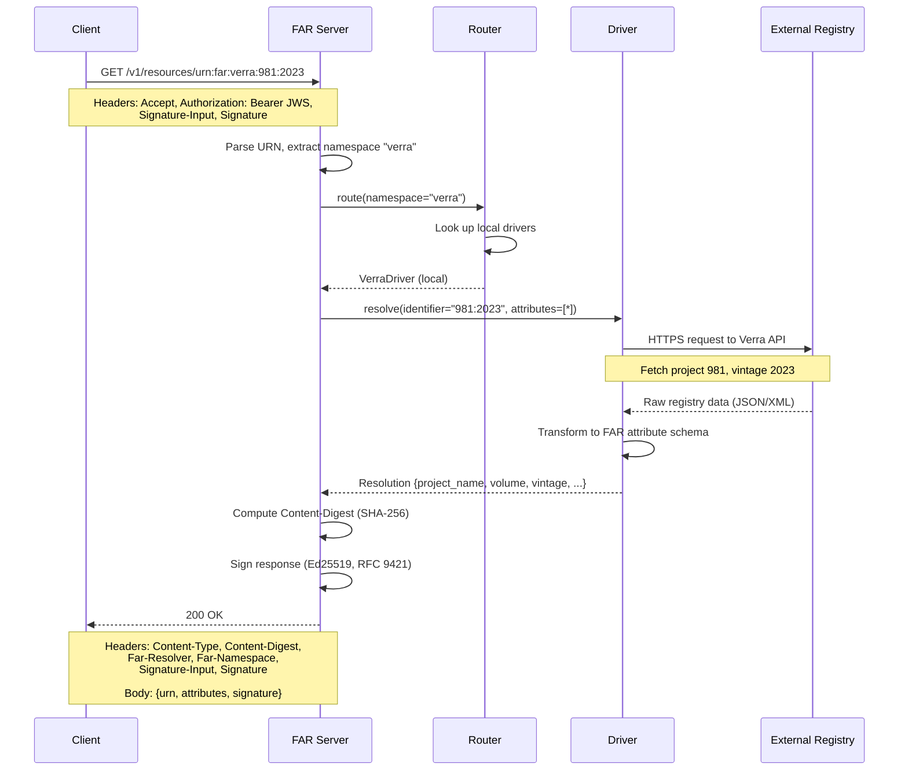
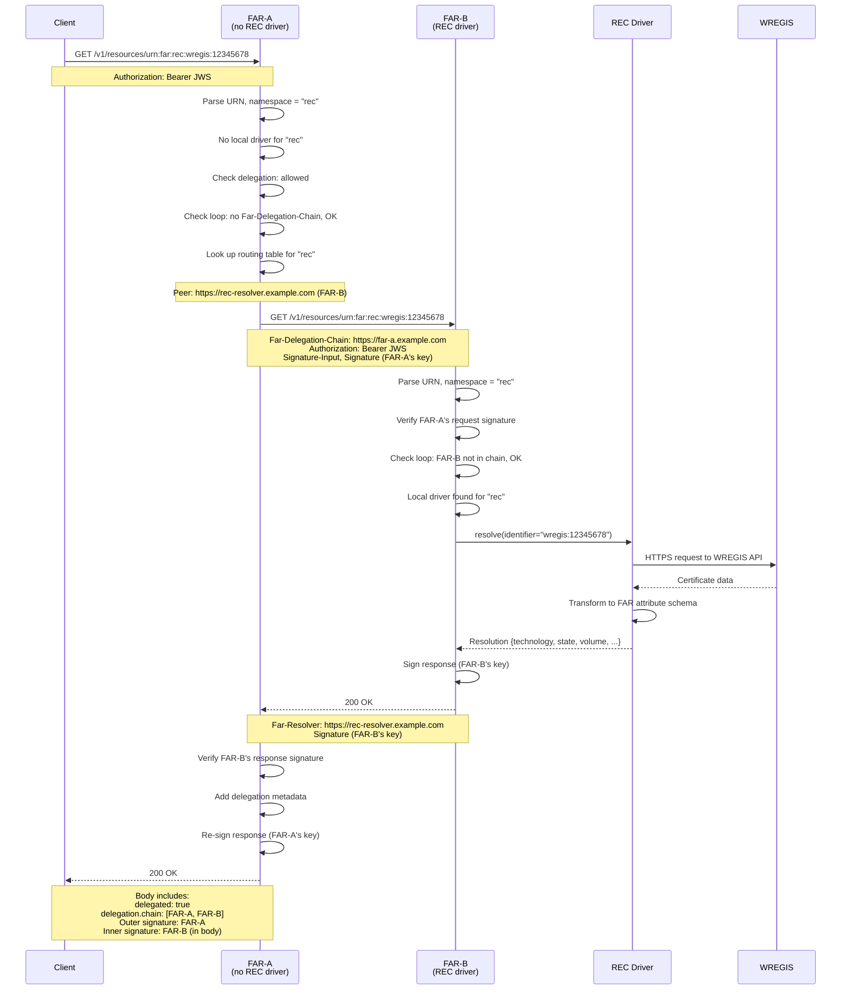
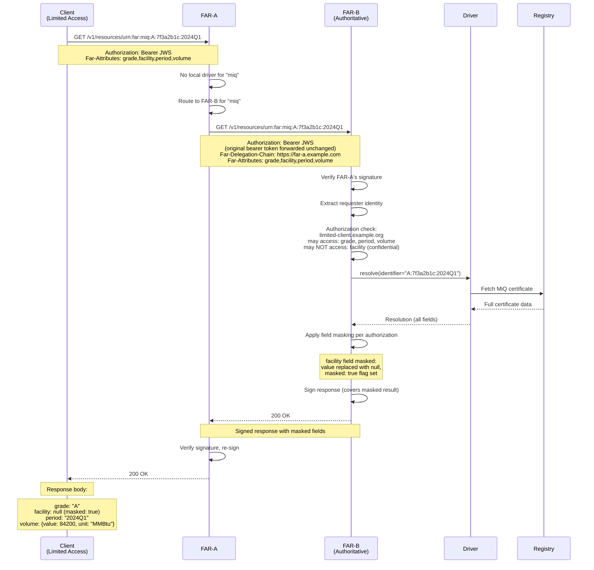
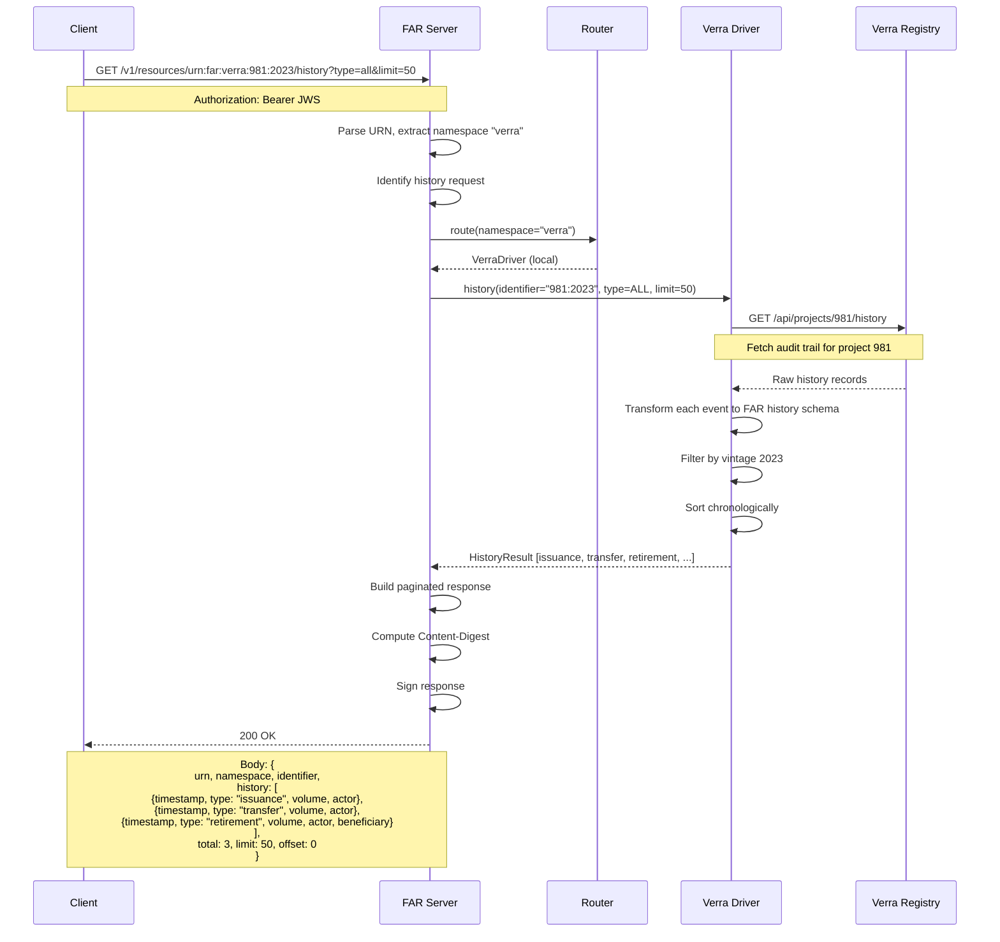
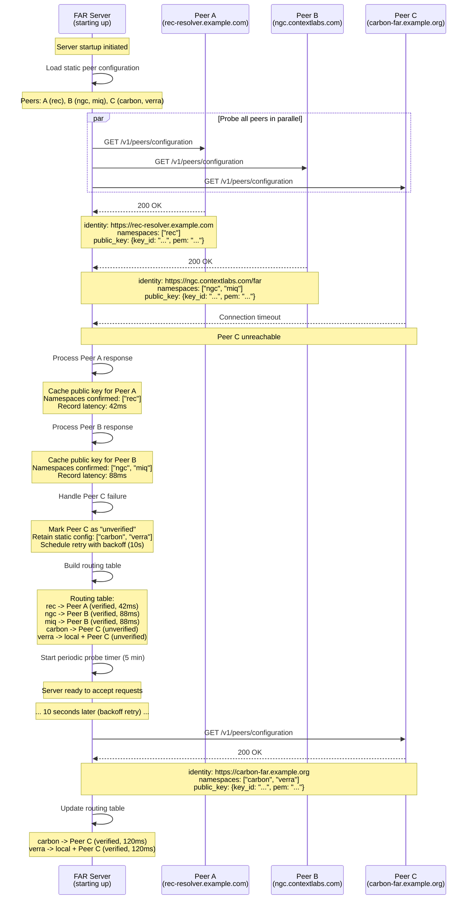

# Sequence Diagrams

**Status:** Draft
**Version:** 0.1.0
**Date:** 2026-02-22

## Overview

This document contains Mermaid sequence diagrams illustrating the key interaction patterns in the Federated Attribute
Resolver (FAR) protocol. Each diagram shows the message flow between participants for a specific scenario.

---

## 1. Direct Resolution

A client resolves a URN for which the FAR server has a local driver. The request is handled entirely within a single
server without delegation.

---

## 2. Delegated Resolution

A client sends a request to FAR-A, which does not have a local driver for the namespace. FAR-A delegates to FAR-B, which
has the appropriate driver.

---

## 3. Identity Propagation and Partial Data

A request carries the end-user's identity through the delegation chain. The resolving server applies authorization rules
and masks fields the requester is not permitted to see.

---

## 4. Certificate History

A client requests the audit history of a certificate. The history endpoint retrieves the chronological record of
events (issuance, transfers, retirements) from the underlying registry.

---

## 5. Peer Discovery

At startup, a FAR server probes all configured peers to build its routing table. It fetches each peer's
`/v1/peers/configuration`, extracts namespace advertisements and public keys, and constructs the namespace-to-peer
routing map.

